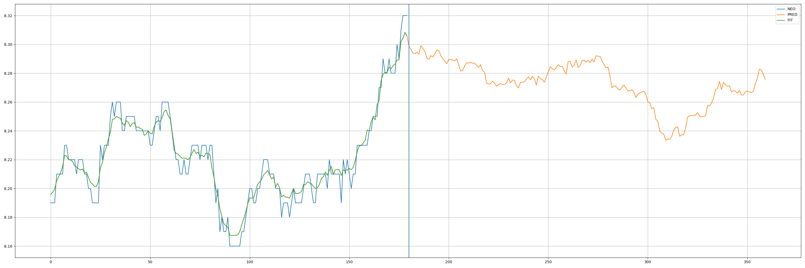

Binance Forecaster with LazyProphet
---



A binance forecaster using LazyProphet library.


Requirements
---
* Python 3.8
* LazyProphet 0.3.7
* python-binance 1.0.16
* pandas 1.4.3
* matplotlib 3.5.2

Data Preparation
---
Download Binance Data (last 7 days, in minutes)
```
client = Client(__api_key, __api_secret)
currencies = client.get_account(timestamp=datetime.now().timestamp())['balances']
for currency in currencies:
  bars = client.get_historical_klines(f'{currency["asset"]}USDT', '1m',
                                      start_str=str(datetime.today() + timedelta(days=-7)),
                                      end_str=str(datetime.today()))
                                            
  for line in bars:
    del line[5:]
  df = pd.DataFrame(bars, columns=['date', 'open', 'high', 'low', 'close'])
```

Training
---
```
y = df['close'].values
model = lp.LazyProphet()
fitted = model.fit(y)
predicted = model.predict(n_future)
```

Training with Quantiles
---
```
for alpha in [0.05, 0.1, 0.25, 0.75, 0.9, 0.95]:
    model = lp.LazyProphet(boosting_params={'objective': 'quantile', 'alpha': alpha})
    fitted = model.fit(y)
    predicted = model.predict(n_future)
```

Define Seasonality
---
```
model = lp.LazyProphet(seasonal_period=[24 * 60, 24*60*7])
```

Prediction
---
```
n_future = 60 * 3  # next 3 hours
predicted = model.predict(n_future)
```

Hyperparameter Tuning with LightGBM
---
```
boosting_params = {
                        "objective": "regression",
                        "metric": "rmse",
                        "boosting_type": "rf",
                        'min_child_samples': 5,
                        'num_leaves': 61,
                        'num_iterations': 100
                    }
model = lp.LazyProphet(boosting_params=boosting_params)
fitted = model.fit(y)
predicted = model.predict(n_future)
```

References
---
* [LazyProphet](https://github.com/tblume1992/LazyProphet)
* [Binance API](https://python-binance.readthedocs.io/en/latest/)
* [LightGBM](https://lightgbm.readthedocs.io/en/v3.3.2/)
